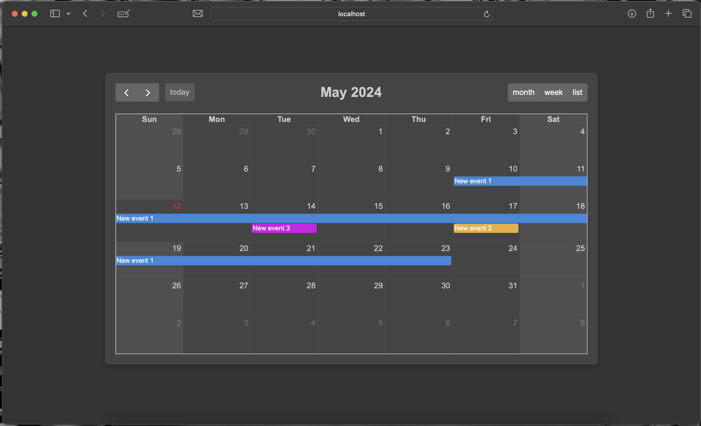

# Display alendar events with Javascript in the browser

This repository uses a javascript library to display a calendar with your events, which should be stored in events.json

Written to practice html, javascript, and CSS styling for creating user interfaces and web applications. Also Part of a project to track time off requests for enterprise software development. 

&nbsp;

<div align="center"></div>

&nbsp;

## Usage

1. Clone this respository
```
git clone (repo link)
```

2. Host locally with python http
```
python3 -m http.server
```

3. Access the calendar at http://localhost:8000 

&nbsp;

<hr>

&nbsp;

<div align="center">


╭━━╮╭━━━┳━━┳━━━┳━╮╱╭╮        ╭╮╱╱╭━━━┳━━━┳╮╭━┳━━━╮
┃╭╮┃┃╭━╮┣┫┣┫╭━╮┃┃╰╮┃┃        ┃┃╱╱┃╭━━┫╭━╮┃┃┃╭┫╭━╮┃
┃╰╯╰┫╰━╯┃┃┃┃┃╱┃┃╭╮╰╯┃        ┃┃╱╱┃╰━━┫╰━━┫╰╯╯┃┃╱┃┃
┃╭━╮┃╭╮╭╯┃┃┃╰━╯┃┃╰╮┃┃        ┃┃╱╭┫╭━━┻━━╮┃╭╮┃┃┃╱┃┃
┃╰━╯┃┃┃╰┳┫┣┫╭━╮┃┃╱┃┃┃        ┃╰━╯┃╰━━┫╰━╯┃┃┃╰┫╰━╯┃
╰━━━┻╯╰━┻━━┻╯╱╰┻╯╱╰━╯        ╰━━━┻━━━┻━━━┻╯╰━┻━━━╯
  


&nbsp;


<a href="https://twitter.com/BrianJosephLeko"></a> &nbsp; &nbsp; &nbsp; &nbsp; &nbsp; &nbsp; <a href="https://github.com/BrianLesko"></a> &nbsp; &nbsp; &nbsp; &nbsp; &nbsp; &nbsp; <a href="https://www.linkedin.com/in/brianlesko/"></a>

follow all of these for a cookie :)

</div>


&nbsp;


